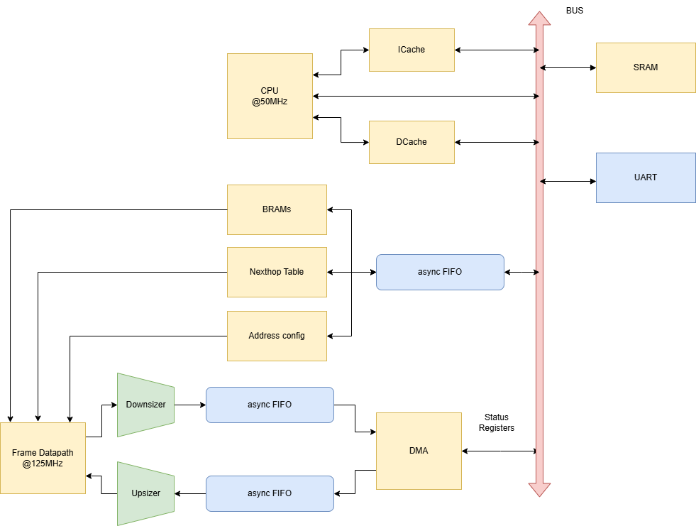
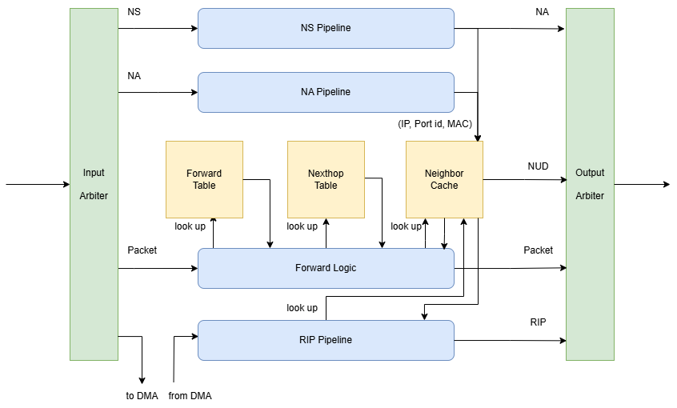
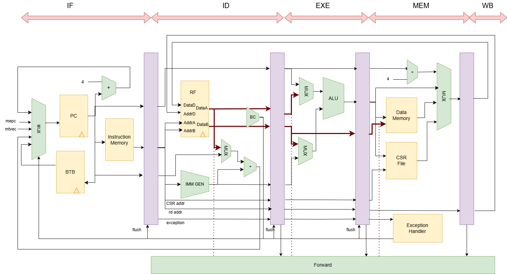

# Core IPv6 Router Implementation

By Jason Fu, Yuxuan Fan, Eason Liu

This project is a lesson project of Computer Network course in Tsinghua University.
Project skeleton is provided by the tanlabs team.

    

## 路由器设计

### 1. 总体设计

### 2. 数据通路部分

### 3. 各组件设计

#### （1）邻居缓存

- 为4个端口各自设置一个容量为8条的全相联邻居缓存，替换策略为FIFO。
- 每条entry都设有一个计时器，过期后该条entry失效。计时器将要到期时，发送NUD。

#### （2）转发逻辑

- 当一个报文不是NS/NA/RIP时，交由转发逻辑处理
- 转发逻辑将首先检查该报文IP头版本、Hop Limit的合法性，若非法则丢弃。
- 若该包合法，转发逻辑将查找转发表（流水线的形式），若没有查到，丢弃该报文。
- 若查到，从`nexthop`表中查出下一条地址与出端口。
- 查询对应端口的邻居缓存，若没有查到，丢弃该报文。
- 若查到，填入出端口号和MAC地址，转发该报文。

#### （3）NS/NA/NUD报文处理

##### NS

NS处理模块收到NS报文后检查校验和，若通过，则发送相应的NA报文，并填写ND缓存。校验和的计算使用了单独的模块，通过多级加法实现。

##### NA

与处理NS类似，不需发送任何报文。

##### NUD

在ND缓存中设置计时器，若有表项的计时达到30s，则发送NS报文。ND缓存项的超时时间为34s，在正常情况下NUD能够保证ND信息不丢失。

#### （4）转发表

##### 数据结构

采用这篇论文中提出的数据结构Value-Coded Trie（以下简称VCTrie）：

O. Erdem, A. Carus and H. Le, "Value-Coded Trie Structure for High-Performance IPv6 Lookup," in The Computer Journal, vol. 58, no. 2, pp. 204-214, Feb. 2015, doi: 10.1093/comjnl/bxt153.

这是一种“后缀压缩”树，在普通Trie的节点上添加了remaining prefix和remaining length两个关键字段，用从根节点到某一节点的路径与该节点存储的remaining prefix的拼接表示一个IPv6前缀。通过增大节点的大小，我们可以在一个节点中存储多个remaining prefix，相当于每个节点都能保存一个路径压缩的子树。

为提高性能和避免一些愚蠢情形，VCTrie限制一个节点能存储的remaining prefix的最大长度为28。一个长度为64的前缀必须从根节点向下探索至少36层才能存储。然而，这条路径可能被完全填满，以至于向下探索64层后发现无处存储表项。此时该前缀被标记为excessive node，移交给一个较小的普通Trie存储。

##### 硬件实现

根据全网路由表的模拟测试，我们将128层Trie分为16级流水线，每级分配一块BRAM，负责8层的存储查询。具体参数如下：

| level | nodes required | nodes provided | node size | bin size | address width |
| ----- | -------------- | -------------- | --------- | -------- | ------------- |
| 0     | 22             | 64             | 54        | 1        | 8             |
| 1     | 159            | 256            | 306       | 7        | 13            |
| 2     | 6083           | 6144           | 612       | 15       | 13            |
| 3     | 7070           | 7168           | 612       | 15       | 13            |
| 4     | 5026           | 5120           | 558       | 14       | 13            |
| 5     | 3032           | 3072           | 414       | 10       | 12            |
| 6~15  | -              | 256            | 54        | 1        | 8             |

其中每个节点对应BRAM的一行，存储以下项目：

- 左子节点地址
- 右子节点地址
- bin size个路由前缀表项

由于0~14级的最后一次查询结果对应下一级的地址，要求0~14级节点的地址宽度必须能够覆盖下一级的所有节点地址。例如，第0级仅有64个节点，但地址位宽为8，以能够表示第1级的所有节点。

每级流水线将查到的局部最长前缀匹配结果向下传递，最终得到正确的下一跳地址。

#### （5）DMA

##### 软硬件接口

CPU通过以下几个状态寄存器与DMA交互：

| 寄存器名             | 功能                                                         |
| -------------------- | ------------------------------------------------------------ |
| `DMA_CPU_STB`        | 若为非零值，则代表CPU向DMA发出一次请求                       |
| `DMA_CPU_WE`         | 若为非零值，则代表CPU予以DMA内存写权限，否则为读权限。       |
| `DMA_CPU_ADDR`       | CPU允许DMA读写的基地址。                                     |
| `DMA_CPU_DATA_WIDTH` | CPU允许DMA读写的地址空间大小                                 |
| `DMA_ACK`            | 若为非零值，代表DMA完成了一次请求。                          |
| `DMA_DATA_WIDTH`     | 仅在DMA向内存写入报文时有效，代表报文的长度，四字节对齐。    |
| `DMA_CHECKSUM`       | 仅在DMA向内存写入报文时有效，代表DMA计算出的，该报文的校验和。 |
| `DMA_IN_PORT_ID`     | 仅在DMA向内存写入报文时有效，代表读入的RIPng报文的入端口号   |
| `DMA_OUT_PORT_ID`    | 仅在DMA从内存读出报文时有效，代表将要发送的RIPng报文的出端口号 |

##### 读入`RIPng`报文

- 数据通路中的`Input arbiter`发现读入的报文为`RIPng`报文时，将送至`DMA`的入`FIFO`，进行缓存及时钟同步处理。
- `DMA`得到CPU授权后，将把报文写入`SRAM`，同时修改状态寄存器的值。
- `DMA`将在写入报文的同时检查校验和。

##### 发送`RIPng`报文

- CPU将要发送`RIPng`报文时，会授权`DMA`读取对应SRAM区域的内容。
- `DMA`得到CPU授权后，将从`SRAM`读出报文，写到`DMA`的出`FIFO`，进行缓存及时钟同步处理。
- `DMA`将在读出报文的同时计算校验和。
- `RIP pipeline`发现出`FIFO`中有合法报文时，将读出该报文，发送至CPU指定的出端口。

#### （6）CPU

